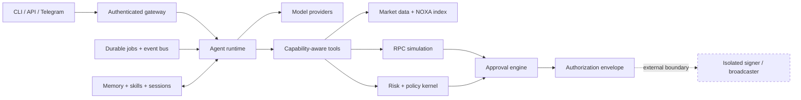

<div align="center">

# ARI OS

### A standalone operating system for autonomous onchain agents

ARI OS gives an AI agent memory, tools, durable jobs, market intelligence, approval workflows, and a hardened execution boundary. It is built for Robinhood Chain, runs independently of any agent framework, and ships with a CLI, HTTP API, Telegram adapter, worker, and NOXA indexer.

[Website](https://ari-os-site.vercel.app) · [Architecture](#how-it-fits-together) · [Quickstart](#quickstart) · [Security](#the-security-boundary) · [Operations](docs/OPERATIONS.md)

</div>

> [!IMPORTANT]
> ARI OS supports funded Robinhood Chain mainnet execution through an isolated, policy-constrained signer. Live mode is triple-opt-in and is not safe by default: verify the build, audit policy and contract addresses, use a dedicated minimally funded wallet, and follow the [trading runbook](docs/TRADING.md). Passing tests is not a security audit.

Production quick start: verify the clone, run `npm run setup:trading -- --account <address> --rpc <url>`, create the keystore with `npm run signer -- create`, then configure the signer, approval keys, API, and recovery loop exactly as described in the [trading runbook](docs/TRADING.md). Supported lifecycle commands include `trade quote`, `buy`/`sell`, `revoke`, `approve`/`deny`, `submit`, `status`, and `reconcile`. Allowance revokes flow through the same exact-transaction approval and isolated-signer pipeline as swaps.

## Why ARI OS exists

Most trading agents are a prompt wrapped around an RPC client. That is fine for a demo. It is a bad place to put capital.

ARI OS treats the model as an untrusted planner. The host owns identity, capabilities, policy, persistence, simulation, approvals, and execution authorization. The model can ask for a typed action; it cannot invent permissions, redirect replies, access a key, or smuggle arbitrary calldata past the control plane.

The result is an agent runtime that can stay online, recover after a crash, process market events, and explain what it wants to do without becoming the custodian of the wallet it is meant to protect.

## What ships today

| Layer | Included |
|---|---|
| Agent runtime | Provider-neutral model routing, fallback policies, bounded tool loops, cancellation, budgets |
| Cognition | Durable memory, skills, session history, FTS search, context compression |
| Autonomy | SQLite job queue, cron schedules, leases, fencing, retries, dead letters, event triggers |
| Market data | Robinhood Chain primitives, Uniswap V3 analytics, OHLCV, NOXA discovery and indexing |
| Risk | Exposure, concentration, drawdown, slippage, liquidity, oracle and sequencer checks |
| Controls | Deterministic policy kernel, durable reservations, exact-transaction approvals |
| Simulation | Pinned-block JSON-RPC simulation with provenance and evidence hashing |
| Authorization | One-time envelopes bound to transaction, nonce, policy, approval, and simulation |
| Interfaces | Authenticated Fastify API, resumable SSE, local/remote CLI, Telegram long polling |
| Extensibility | Signed plugin manifests, capability mediation, isolated plugin workers |
| Operations | Health, metrics, audit roots, Docker, Compose, systemd units, migration tools |

## How it fits together



The dashed edge matters. The shipped `raos-signer` process owns the encrypted keystore outside the API/model process. It independently decodes the serialized transaction, verifies policy and authorization claims, rechecks the nonce, and atomically consumes the one-time envelope before signing and broadcasting.

## Quickstart

ARI OS requires **Node.js 22 or newer**.

```bash
git clone https://github.com/venymlabs/ari-os.git
cd ari-os
npm ci
npm run verify
npm run build
```

Start with a private local data directory and an API token:

```bash
export DATA_DIR="$HOME/.local/state/ari-os"
export NETWORK=testnet
export EXECUTION_MODE=read-only
export API_BEARER_TOKEN="replace-this-with-a-long-random-token"
export API_SCOPES="agent:read,agent:write,tool:read,tool:invoke,simulation:invoke"

npm start
```

Check the process:

```bash
curl -fsS http://127.0.0.1:8787/livez
curl -fsS http://127.0.0.1:8787/readyz
curl -fsS http://127.0.0.1:8787/version
```

Operational endpoints are public so a local supervisor can probe them. Application routes require bearer authentication and fail closed when no token is configured.

## CLI

The package exposes `raos` and `raos-telegram`.

```bash
# Local mode: opens the configured local state
npm run cli -- status
npm run cli -- sessions
npm run cli -- tools
npm run cli -- markets
npm run cli -- jobs

# Remote mode: talks to a running ARI OS server
raos --remote http://127.0.0.1:8787 \
  --token "$API_BEARER_TOKEN" \
  sessions

# Simulation input can be inline, a file, or stdin
raos simulate '{"transaction":{}}'
raos simulate @request.json
cat request.json | raos simulate -
```

Every command returns a stable JSON envelope:

```json
{"ok":true,"result":{}}
```

If a dependency is missing, ARI OS says so. It does not substitute plausible empty market data or synthetic simulation results.

## Configure chain access

RPC-backed tools remain unavailable until an RPC endpoint is configured.

```bash
export RPC_URL="https://your-robinhood-testnet-rpc.example"
export CHAIN_ID=46630
export NOXA_FACTORY_ADDRESS="0xD9eC2db5f3D1b236843925949fe5bd8a3836FCcB"
export NOXA_FACTORY_START_BLOCK=0
```

ARI OS verifies the configured chain identity. A mismatched chain ID fails startup rather than quietly querying the wrong network.

Mainnet cannot be selected accidentally. It requires both flags:

```bash
export NETWORK=mainnet
export MAINNET_ENABLED=true
export MAINNET_ACKNOWLEDGE_RISK=I_ACKNOWLEDGE_MAINNET_RISK
```

This unlocks mainnet selection only. Funded execution additionally requires `EXECUTION_MODE=live`, `LIVE_TRADING_ENABLED=true`, `LIVE_TRADING_ACKNOWLEDGE_RISK=I_ACKNOWLEDGE_LIVE_TRADING_RISK`, trading limits/account, private approval and authorization key files, and the isolated signer. See [Production trading](docs/TRADING.md).

## API surface

The standalone server provides:

| Route | Purpose | Authentication |
|---|---|---|
| `GET /livez` | Process liveness | Public |
| `GET /readyz` | Dependency readiness | Public |
| `GET /metrics` | Prometheus-style metrics | Public |
| `GET /version` | Build and runtime metadata | Public |
| `GET /v1/health` | Application health | Public |
| `GET /v1/sessions` | Durable sessions | Scoped bearer token |
| `GET /v1/tools` | Available tool schemas | Scoped bearer token |
| `POST /v1/tools/:name/invoke` | Capability-checked invocation | Scoped bearer token |
| `GET /v1/markets` | Configured market tools | Scoped bearer token |
| `GET /v1/jobs` | Durable job state | Scoped bearer token |
| `POST /v1/simulate` | Read-only transaction simulation | Scoped bearer token |
| `POST /v1/runs` | Start an asynchronous agent run | Scoped bearer token |
| `GET /v1/runs/:id/events` | Resume run events over SSE | Scoped bearer token |
| `POST /v1/trading/quote` | Quote and pin an exact simulated transaction | `trading:quote` |
| `POST /v1/trading/execute` | Create an idempotent dry-run/live execution | `trading:execute` |
| `POST /v1/trading/revoke` | Create an idempotent allowance-revoke execution | `trading:execute` |
| `GET /v1/trading/executions/:id` | Read durable execution/approval state | `trading:read` |
| `POST /v1/trading/executions/:id/approve` | Submit operator approval proof | `trading:approve` |
| `POST /v1/trading/executions/:id/submit` | Authorize, sign, and broadcast | `trading:submit` |
| `POST /v1/trading/reconcile` | Recover and reconcile pending executions | `trading:reconcile` |

Bind the server to localhost by default. Put it behind TLS and a trusted identity-aware reverse proxy before exposing it to a network.

## Telegram

Telegram is optional and default-deny. The runner stores its update offset before dispatch, preventing replay after a restart.

```bash
export TELEGRAM_BOT_TOKEN="..."
export TELEGRAM_ALLOWED_USER_IDS="123456789"
export TELEGRAM_ALLOWED_CHAT_IDS="-1001234567890"
export RAOS_API_URL="http://127.0.0.1:8787"
export RAOS_API_TOKEN="$API_BEARER_TOKEN"

npm run telegram
```

ARI OS identifies Telegram actors by numeric user and chat IDs, never usernames. An empty allowlist permits nobody.

## Durable workers and indexing

```bash
# Apply/check local SQLite state
npm run db:migrate
npm run db:status
npm run db:integrity

# Process one durable job
npm run worker -- --once

# Index one confirmed NOXA range (requires RPC_URL)
npm run indexer -- --once
```

Jobs use leases and fencing tokens. Events are ordered per consumer. Retries are bounded, poison work is dead-lettered, and unfinished state survives process restarts.

Do not horizontally scale SQLite writers against the same data directory. Use one writer set per state volume.

## The security boundary

ARI OS assumes model output, plugins, RPC responses, token metadata, indexers, and chat input may be malicious.

Controls are independent by design:

- The model never receives signing material.
- Tools declare capabilities, effects, schemas, timeouts, and availability.
- Plugins start from a closed capability allowlist.
- Reservations count pending exposure before another trade can pass policy.
- Approvals bind authenticated operators to an exact transaction and simulation.
- Authorization envelopes are short-lived, one-time, and replay protected.
- The isolated signer rechecks transaction fields, policy, authorization, replay state, and account nonce.
- Audit events are append-only and can be anchored with Merkle roots.
- Missing or unhealthy dependencies fail closed.

### What ARI OS does not claim

- It is not a general-purpose wallet; the signer is a narrow policy-constrained execution boundary.
- It does not make smart contracts safe.
- It does not remove oracle, sequencer, MEV, bridge, governance, or chain risk.
- Passing tests is not a substitute for an external security audit.
- Funded execution remains operator-controlled and high risk; deployment requires explicit live opt-ins, exact-transaction approval, and an independently reviewed policy.

Read the full [security doctrine](docs/SECURITY.md) before extending the execution path.

## Development

```bash
npm test                 # Vitest
npm run typecheck        # strict TypeScript
npm run build            # clean production build
npm run verify           # tests + typecheck + build
npm audit --omit=dev     # production dependencies
npm pack --dry-run       # inspect the release artifact
```

Current acceptance baseline:

```text
54 test suites
400 tests
3/3 live Robinhood RPC and deployed-bytecode checks
Strict TypeScript build, ESLint, and Prettier gates
Green on Linux and Windows
0 known production dependency vulnerabilities
Clean npm tarball install verified
```

The suite includes restart recovery, multi-connection SQLite races, stale-worker fencing, replay attempts, malformed RPC data, tenant isolation, forged approval proofs, exposure oversubscription, allowance-revoke lifecycle and tamper cases, package installation, and real subprocess entrypoints. CI runs the full verify pipeline on Ubuntu and Windows for every push and pull request.

## Deployment

The repository includes:

- A multi-stage, non-root [`Dockerfile`](Dockerfile)
- Hardened [`compose.yaml`](compose.yaml) profiles
- API, signer, migration, and Telegram units under [`deploy/systemd`](deploy/systemd)
- Backup, recovery, and incident procedures in [`docs/OPERATIONS.md`](docs/OPERATIONS.md)

Containers use a read-only root filesystem. Persistent state belongs under `/var/lib/raos`; `/tmp` is the only other writable path.

## Project map

```text
src/
├── agent/          model routing, runtime, tool registry
├── autonomy/       jobs, schedules, event bus, delegation
├── cognition/      memory, skills, context compression
├── execution/      policy, approvals, simulation, authorization
├── gateway/        protocol, API, channel adapters
├── indexers/       reorg-aware NOXA indexing
├── market/         Uniswap V3 and OHLCV analytics
├── observability/  logs, metrics, health, audit roots
├── plugins/        signed manifests and sandbox host
├── storage/        durable SQLite stores
├── telegram/       polling and offset management
└── bin/            server-adjacent operational entrypoints
```

Deeper references:

- [Architecture](docs/ARCHITECTURE.md)
- [Security doctrine](docs/SECURITY.md)
- [Operator runbook](docs/OPERATIONS.md)
- [Production trading runbook](docs/TRADING.md)
- [Production contracts and RPC behavior](docs/PRODUCTION-CONTRACTS.md)
- [Research notes](docs/RESEARCH.md)
- [Third-party notices](THIRD_PARTY_NOTICES.md)

## Contributing

Keep the custody boundary intact.

1. Add a failing test first.
2. Make the smallest change that passes it.
3. Run `npm run verify`.
4. Add adversarial coverage for authorization, persistence, or concurrency changes.
5. Never add a private key, seed phrase, raw signing endpoint, or unrestricted broadcast tool.

Security-sensitive changes should explain their failure model, transaction boundary, replay behavior, and restart semantics in the pull request.

## License

ARI OS is open source under the [MIT License](LICENSE).

Built by [Venym Labs](https://github.com/venymlabs).
